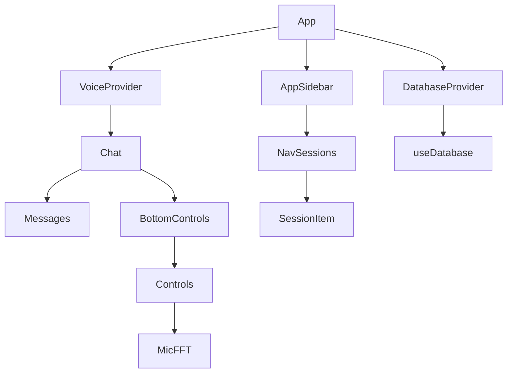
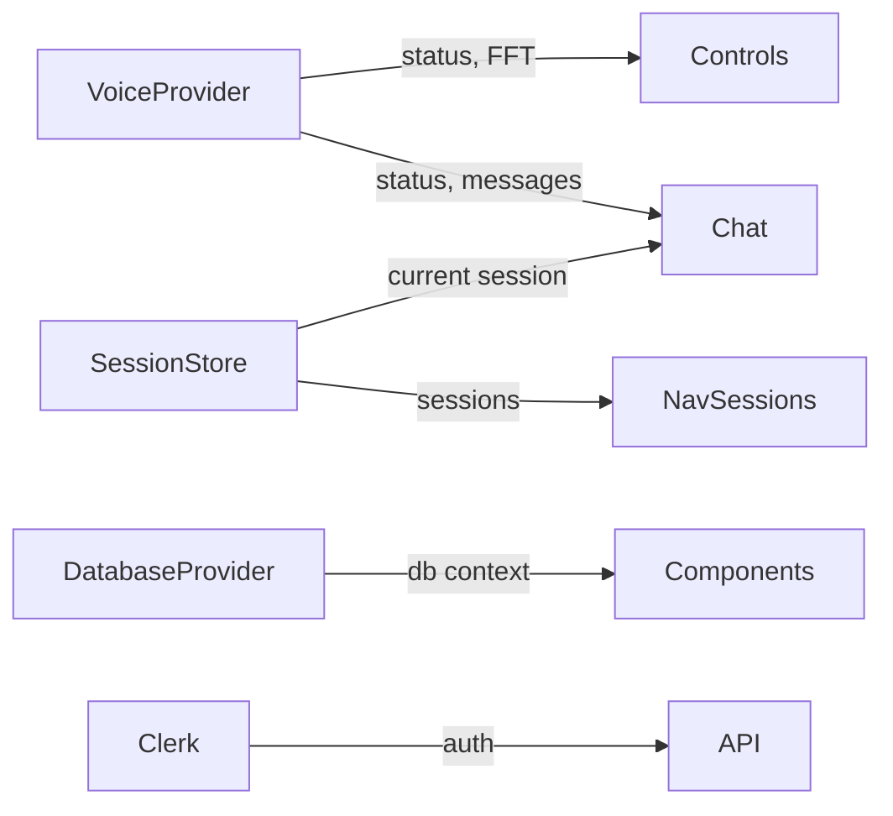
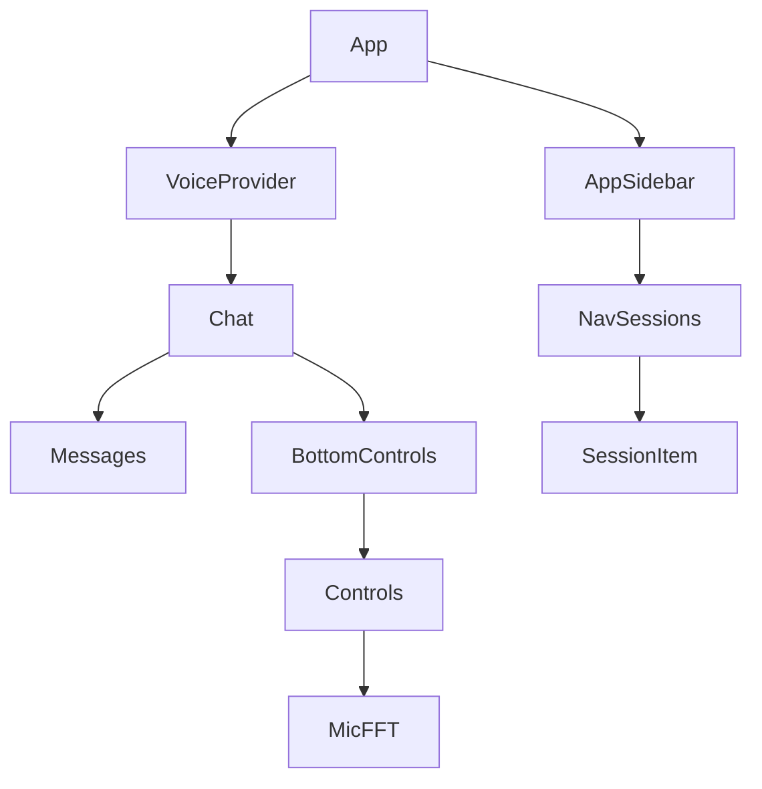
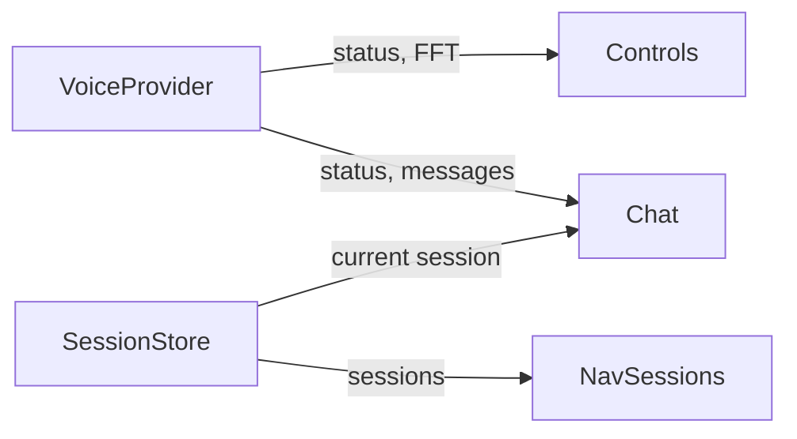

# Meld Application File Structure

## Project Structure

```
├── src/                        # Frontend application code
│   ├── App.tsx                 # Root application component
│   ├── index.css              # Global styles
│   ├── global.d.ts            # TypeScript declarations
│   │
│   ├── components/            # React components
│   │   ├── chat-input/        # Voice input components
│   │   │   ├── BottomControls.tsx     # Main controls container
│   │   │   ├── ChatInputForm.tsx      # Text input form
│   │   │   ├── Controls.tsx           # Voice control buttons
│   │   │   ├── MicFFT.tsx            # FFT visualization
│   │   │   ├── chat-input.tsx        # Input container
│   │   │   └── magnetize-button.tsx   # Action button
│   │   │
│   │   ├── chat-window/      # Chat display components
│   │   │   ├── Chat.tsx         # Main chat container
│   │   │   ├── Messages.tsx     # Message list
│   │   │   ├── Expressions.tsx  # Expression display
│   │   │   └── expressions-utils/
│   │   │       ├── expressionColors.ts
│   │   │       └── expressionLabels.ts
│   │   │
│   │   ├── layout/          # Layout components
│   │   │   └── layout.tsx    # Main layout wrapper
│   │   │
│   │   ├── providers/       # React context providers
│   │   │   └── DatabaseProvider.tsx
│   │   │
│   │   ├── sidebar/         # Navigation components
│   │   │   ├── app-sidebar.tsx  # Main sidebar
│   │   │   ├── nav-sessions.tsx # Session navigation
│   │   │   └── nav-user.tsx     # User navigation
│   │   │
│   │   └── ui/             # Shared UI components
│   │       ├── alert.tsx
│   │       ├── avatar.tsx
│   │       ├── button.tsx
│   │       ├── card.tsx
│   │       ├── dropdown-menu.tsx
│   │       ├── input.tsx
│   │       ├── label.tsx
│   │       ├── plan-toggle.tsx
│   │       ├── separator.tsx
│   │       ├── sheet.tsx
│   │       ├── sidebar.tsx
│   │       ├── skeleton.tsx
│   │       ├── switch.tsx
│   │       ├── textarea.tsx
│   │       ├── toggle.tsx
│   │       └── tooltip.tsx
│   │
│   ├── hooks/              # Custom React hooks
│   │   ├── use-mobile.tsx   # Mobile detection
│   │   ├── use-sessions.ts  # Session management
│   │   └── useDatabase.ts   # Database interactions
│   │
│   └── lib/               # Utilities and services
│       ├── db.ts           # Database utilities
│       ├── prisma.ts       # Prisma client setup
│       ├── session-store.ts # Session management
│       └── utils.ts        # Shared utilities
│
├── server/                # Backend server code
│   ├── Dockerfile         # Server container config
│   ├── bun-server.ts      # Bun server entry
│   │
│   └── api/              # API routes and handlers
│       ├── chat/         # Chat-related endpoints
│       │   ├── hume-context-tracker.ts
│       │   ├── llm-model-choice-helper.ts
│       │   └── working-route.ts
│       │
│       └── clerk/        # Authentication
│           ├── clerk-webhooks.ts
│           ├── hume-auth.ts
│           └── hume-types.ts
│
├── prisma/               # Database schema and migrations
│   └── schema.prisma     # Database schema definition
│
└── docs/                # Documentation
    ├── performance-optimization-plan.md
    └── file-tree.md     # This file
```

## Component Relationships



## State Flow



## Key Components and Their Roles

### Frontend Components
- **Chat Components**: Message display and voice interaction
- **Navigation Components**: Session and user management
- **UI Components**: Shared design system
- **Providers**: State and context management

### Backend Components
- **API Routes**: Chat and authentication endpoints
- **Database**: Prisma schema and migrations
- **Server**: Bun runtime and configuration

## Performance Considerations

Key areas for optimization:
1. Voice data flow (FFT updates)
2. Message rendering and storage
3. Session state management
4. UI animations and transitions
5. Database queries and caching
6. API response times

See `performance-optimization-plan.md` for detailed optimization strategies.

```

## Component Relationships



## State Flow



## Key Components and Their Roles

### Voice Components
- **BottomControls**: Manages voice connection state and UI transitions
- **Controls**: Handles mute/unmute and call end functionality
- **MicFFT**: Visualizes microphone input frequency data

### Chat Components
- **Chat**: Main container for messages and input
- **Messages**: Renders and manages message history
- **Expressions**: Visualizes prosody scores

### Navigation Components
- **AppSidebar**: Main navigation container
- **NavSessions**: Manages session list and selection

## Performance Considerations

Key areas for optimization:
1. Voice data flow (FFT updates)
2. Message rendering and storage
3. Session state management
4. UI animations and transitions

See `performance-optimization-plan.md` for detailed optimization strategies.
